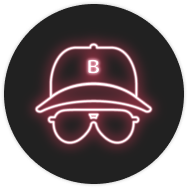

<h1 align="center">Example Beken Engine</h1>

  <strong>:high_brightness: Make your app a super app with Beken :high_brightness:</strong> 
  Beken Engine is a machine that runs beked products in the form of <strong>PWA</strong> <em>(Progresive Web App)</em>. 
  Beken engine can run on all stack dev mobile. 
  Available for Android and IoS for all stack dev

 

    &nbsp;
    &nbsp;
    &nbsp;
    &nbsp;
    &nbsp;
    &nbsp;
    

    &nbsp;
    &nbsp;
    &nbsp;
    &nbsp;
    

